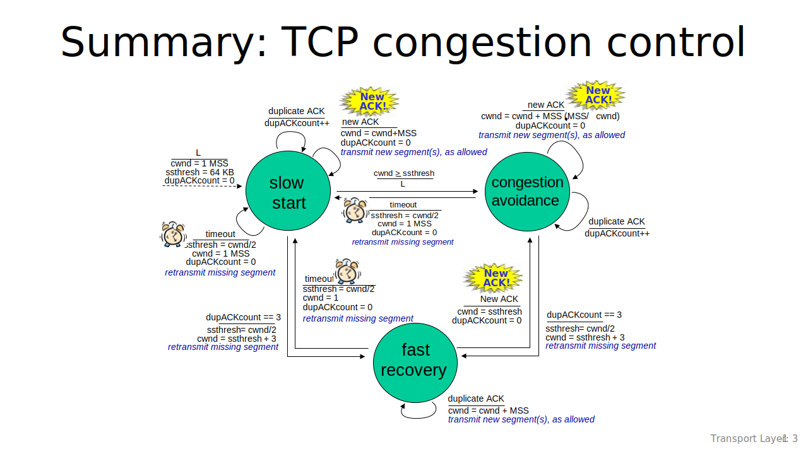

#### Reliable File Transmission Protocol Based on UDP

Using `sendto()` and `recvfrom()` functions in `<sys/socket.h>` to achieve reliable file transmission. Both of the functions transmit UDP datagrams.

##### System Design

USing the logic same as TCP congestion control.

